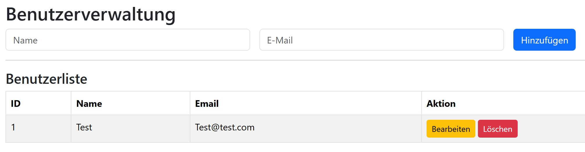

# 📋 PHP SQLite CRUD WebApp mit Bootstrap & jQuery

Dies ist ein einfaches, aber vollständiges Beispiel für eine moderne WebApp mit:

- PHP (Backend)
- SQLite (Datenbank)
- Bootstrap 5 (Design & Layout)
- jQuery (AJAX & DOM-Interaktion)

Die Anwendung zeigt, wie man eine vollständige **CRUD-Logik (Create, Read, Update, Delete)** mit **asynchronem Datenaustausch über AJAX** und **modale Dialoge** für Fehlerbehandlung integriert.

---

## 🚀 Features

✅ Bootstrap 5 Oberfläche  
✅ jQuery-basierte AJAX-Aufrufe  
✅ SQLite-Datenbank ohne externe Abhängigkeiten  
✅ Modale Fehlermeldungen bei Problemen (z. B. fehlende PHP-Module)  
✅ Saubere Trennung von Frontend und Backend  
✅ Leicht erweiterbar und portabel  

---

## 📂 Projektstruktur

```plaintext
/
├── index.php           # Startseite mit Tabelle und Modalen
├── script.js           # jQuery & AJAX Logik
├── backend.php         # Backend-API für CRUD (PHP)
└── README.md           # Diese Datei
```

---

## 🛠 Voraussetzungen

- PHP 7.4 oder neuer
- SQLite3-Modul für PHP (`sqlite3` aktiviert in `php.ini`)
- Ein Webserver wie Apache oder PHPs eingebauter Server

---

## 📦 Installation

1. **Repository klonen**  
   ```bash
   git clone https://github.com/m-reisner/php_ajax.git
   cd php_ajax
   ```

2. **PHP-Server starten (optional)**  
   ```bash
   php -S localhost:8000
   ```

3. **Im Browser öffnen**  
   [http://localhost:8000](http://localhost:8000)

---

## ⚠️ Fehlerbehandlung

Falls das `sqlite3`-Modul nicht geladen ist, wird automatisch ein modaler Fehlerdialog angezeigt mit einem Hinweis zur aktiven `php.ini`-Datei.

---

## 🧪 Demo-Screenshot



---

## 💡 Hinweise zur Weiterentwicklung

- Du kannst Felder und Tabellenstruktur leicht erweitern
- Die `backend.php` enthält alle CRUD-Endpunkte – du kannst dort weitere Logik hinzufügen (z. B. Validierung, Authentifizierung)
- Alle Frontend-Funktionen nutzen Bootstrap-kompatible Elemente und können einfach angepasst werden

---

## 📖 Lizenz

Dieses Projekt steht unter der MIT-Lizenz. Nutze es frei für eigene Projekte.

---

## 🤝 Autor

Erstellt von [m-reisner](https://github.com/m-reisner)
